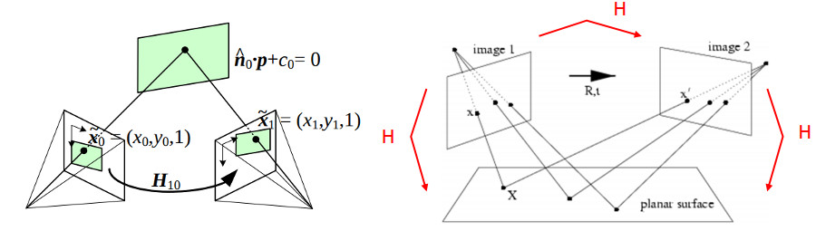

# [Basic concepts of the homography explained with code](https://docs.opencv.org/4.x/d9/dab/tutorial_homography.html)

## Basic Theory
- Planar homography relates to the transformation between two planes
  - Also known plainly as 'homography'
- 3x3 matrix with 8 DoF that's generally normalized

<!-- ## Examples of different kinds of transformations 
### Planar surface and the image plane

### Planar surface viewed by two camera positions

 -->

# Demo 3: Homography from the camera displacement
- Homography relates to transformation between two planes
- Possible to retrieve corresponding camera displacement that lets you go from the first to the second plane view

## cv::solvePnP()
- This function lets you compute the camera pose from it's corresponding 3D object points; points EXPRESSED in the object frame, 
  - And the 2D image points; object points VIEWED in the image
- Both intrinsic parameters and distortion coefficients are needed

## Summary of screenshot
